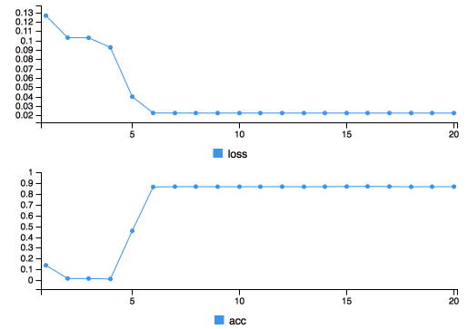

An image can be viewed as a function mapping pixel locations $x,y$ to color values $R,G,B$. Since neural networks are function approximators, we can train such a network to approximate an image. The network is then a representation of the image as a function and its contents can be displayed by evaluating the network for all pixel pairs $x,y$.  

The `Keras` package for `R` is now approximately [1 year old](https://blog.rstudio.com/2017/09/05/keras-for-r/) but I have to admit that I usually go to Python to implement neural networks. Since I wanted to try the `imager` package for `R` for a while, let's hit two birds with one stone and do this exercise in `R`.  

First, we need the right packages.

```{r message=FALSE, warning=FALSE}
library(tidyverse)
library(keras)
library(imager)
```

To honour the name of this blog, let's pick an image of the bird species godwit (scientific name: _limosa_) and load it using `imager`'s `load.image`. 

```{r message=FALSE, warning=FALSE}
# Image from Pixabay
im_url <- "https://cdn.pixabay.com/photo/2015/09/18/00/13/bar-tailed-godwit-944883_640.jpg"
im <- load.image(im_url)
dim(im)
```

The image is 640x480 pixels in size, consists of 1 frame (it is not a video) and 3 color channels.  
Plotting the image is easy. We choose to show the image without axes and make the margins small for aestetic reasons.

``` r 
plot(im, axes = FALSE)
```
```{r echo=FALSE, fig.cap='A godwit. Source: pixabay.com'}
knitr::include_graphics("image.png")
```

We convert the image to a data frame by calling `as.data.frame` on the image object. This data frame by default has 4 columns: an _x_ and _y_ column to identify each pixel's location, a color channel column _cc_, and the _value_ this channel takes at this pixel. We spread the key-value pairs in the _cc_ and _value_ columns into columns _cc_1_, _cc_2_, _cc_3_ representing the three color values.

```{r}
df <- im %>% as.data.frame %>% spread(cc, value)
head(df)
```

The color values are between 0 (absent) and 1 (present).  
We create input and output matrices which can be fed into keras. 

```{r}
X <- as.matrix(select(df, x, y))
Y <- as.matrix(select(df, -x, -y))
```

Creating a neural network with keras is very easy. We tell it that we want an 'ordinary' feed forward neural network with `keras_model_sequential()`. For starters, we create a one-layer network with 2 input nodes (_x_ and _y_ coordinates) and 3 output nodes (_R_, _G_, _B_ values). We choose a 'sigmoid' activation function because we want the output values to be between 0 and 1.

``` r
model <- keras_model_sequential() 
model %>%
  layer_dense(3, input_shape = 2, activation = "sigmoid")
summary(model)
```
```{r echo=FALSE}
model <- load_model_hdf5("model1.hdf5")
summary(model)
```

When compiling the model, we tell it what loss function we need, what optimizer and what kind of metrics we want it to display while training. We choose a _mean_squared_error_ loss, which means that we penalize every color channel equally, taking the square of the error for every channel and every pixel. We optimize the network using the widely used Adam optimizer and we want to see its accuracy while training.

``` r
model %>% compile(
  loss = "mean_squared_error",
  optimizer = optimizer_adam(),
  metrics = "accuracy"
)
```

Next, we actually fit the model, giving it the expected input and output matrices _X_ and _Y_. We set the batch size to 128 such that training is faster than the default 32. We train the network for 20 epochs.

``` r
model %>% fit(
  X, Y, 
  batch_size = 128,
  epochs = 20
)
```
```{r echo=FALSE, message=FALSE, warning=FALSE, fig.cap='Training progress', out.width='320px'}

```

Training takes about 1 minute, and as can be seen from the training plot, it seems that both the loss and the accuracy have saturated. An accuracy of 0.9 sounds good, but let's take a look at the output image before we get too happy.  
First, we need to recreate the original dataframe with the predicted pixel values. For every $(x,y)$ pair in our matrix _X_ we need to make a prediction. We duplicate the original dataframe fill the color channel columns with the network's output values. We then call `gather` on this dataframe to create the _cc_ and _value_ columns necessary for the `imager` library.

``` r
df_out <- df
df_out[, 3:5] <- model %>% predict(X)
df_out <- df_out %>% gather(key = "cc", value = "value", -x, -y, convert = TRUE)
```

With the data frame in the right form, we can display the result next to the original image very easily. We convert the data frame to an image with the `as.cimg` function and paste it next to the original image by wrapping them inside a list and calling `imappend` on it, specifying we want them appended on the horizontal axis.

``` r
as.cimg(df_out) %>% list(im, .) %>% imappend("x") %>% plot(axes = F)
```
```{r eval=FALSE, message=FALSE, warning=FALSE, include=FALSE}
as.cimg(df_out) %>% list(im, .) %>% imappend("x") %>% save.image("model1.png")
```
```{r echo=FALSE, message=FALSE, warning=FALSE, fig.cap='The network learned a gradient'}
knitr::include_graphics("model1.png")
```

The result is a vertical gradient, which can also be seen when looking at the model weights.

```{r}
model$get_weights()
```

The values corresponding to the _x_ column are positive, while the _y_ values are negative and about one order of magnitute larger.

# More layers
Now let's try a network with more layers. More specifically, let's add two layers with both 10 nodes followed by sigmoid activations.

``` r
model <- keras_model_sequential()
model %>%
  layer_dense(10, input_shape = 2, activation = "sigmoid") %>%
  layer_dense(10, activation = "sigmoid") %>%
  layer_dense(3, activation = "sigmoid")

model %>% compile(
  loss = "mean_squared_error",
  optimizer = optimizer_adam(),
  metrics = "accuracy"
)

model %>% fit(
  X, Y,
  batch_size = 128,
  epochs = 20
)

df_out <- df
df_out[, 3:5] <- model %>% predict(X)
df_out <- df_out %>% gather(key = "cc", value = "value", -x, -y, convert = TRUE)

as.cimg(df_out) %>% list(im, .) %>% imappend("x") %>% plot(axes = F)
```
```{r eval=FALSE, message=FALSE, warning=FALSE, include=FALSE}
as.cimg(df_out) %>% list(im, .) %>% imappend("x") %>% save.image("model2.png")
```
```{r echo=FALSE, message=FALSE, warning=FALSE, fig.cap='Some features of the bird appear'}
knitr::include_graphics("model2.png")
```

As can be seen, the image is already picking up some countours of the bird, together with some 'rays' coming from the top-left corner. If we go for an even deeper network, more of the bird's features can be recognized from the image.

``` r
model <- keras_model_sequential()
model %>%
  layer_dense(100, input_shape = 2, activation = "tanh") %>%
  layer_dense(100, activation = "relu") %>%
  layer_dense(100, activation = "relu") %>%
  layer_dense(100, activation = "relu") %>%
  layer_dense(100, activation = "relu") %>%
  layer_dense(3) %>% 
  layer_activation_relu(max_value=1)

model %>% compile(
  loss = "mean_squared_error",
  optimizer = optimizer_adam(),
  metrics = "accuracy"
)

model %>% fit(
  X, Y,
  batch_size = 128,
  epochs = 100
)

df_out <- df
df_out[, 3:5] <- model %>% predict(X)
df_out <- df_out %>% gather(key = "cc", value = "value", -x, -y, convert = TRUE)

as.cimg(df_out) %>% list(im, .) %>% imappend("x") %>% plot(axes=F)
```
```{r eval=FALSE, message=FALSE, warning=FALSE, include=FALSE}
as.cimg(df_out) %>% list(im, .) %>% imappend("x") %>% save.image("model3.png")
```
```{r echo=FALSE, message=FALSE, warning=FALSE, fig.cap='The image is nicely recovered'}
knitr::include_graphics("model3.png")
```

Ways to improve this might include more layers, more epochs, different activation functions, different loss function. For now, I'm really happy with the result!