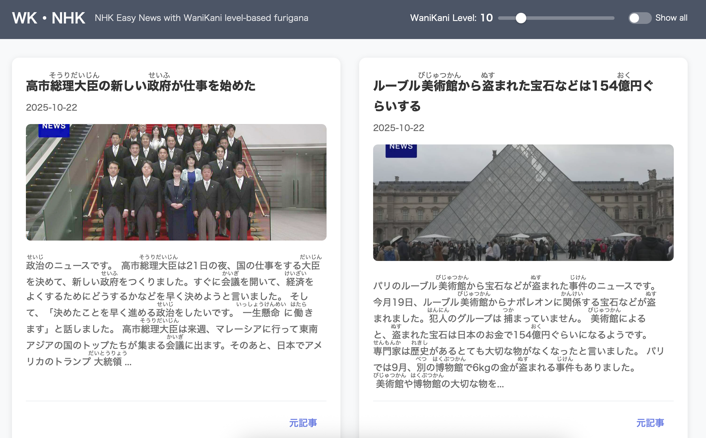

I created a website [www.wk-nhk.com](https://www.wk-nhk.com/) that shows [NHK Web Easy](https://news.web.nhk/news/easy/) articles with custom furigana based on WaniKani level.

I try to read a couple of NHK Easy articles each day, but I found that even though I know some of the kanji, my eyes read the furigana anyways. That feels like cheating and it does not force me to practice the kanji.  

In this new website, you can select your WaniKani level with the slider and watch the furigana you know disappear. That way, you are forced to read the kanji you are supposed know, and only see furigana for kanji you do not know.  

The site updates each day via GitHub actions to show the latest articles. Find the code [here](https://github.com/basjacobs93/wk-nhk/).

