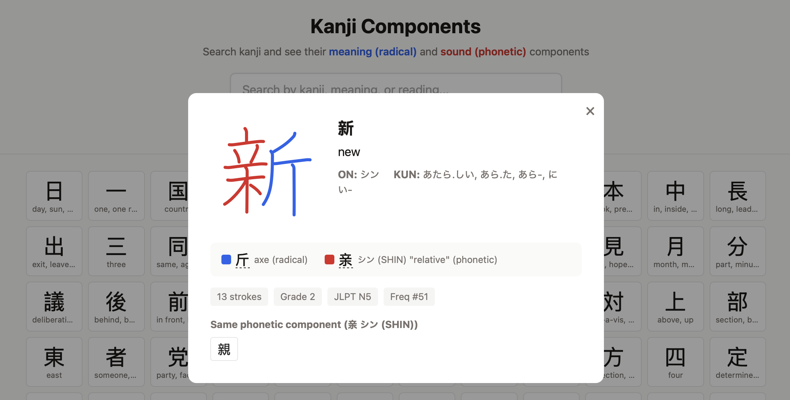

I made a small website where you can browse kanji and visualize their radicals and phonetic components. You can search for kanji or component.

The website is here: [basjacobs93.github.io/kanji-phonetic-components](https://basjacobs93.github.io/kanji-phonetic-components/), and source code is here: [github.com/basjacobs93/kanji-phonetic-components](https://github.com/basjacobs93/kanji-phonetic-components).

